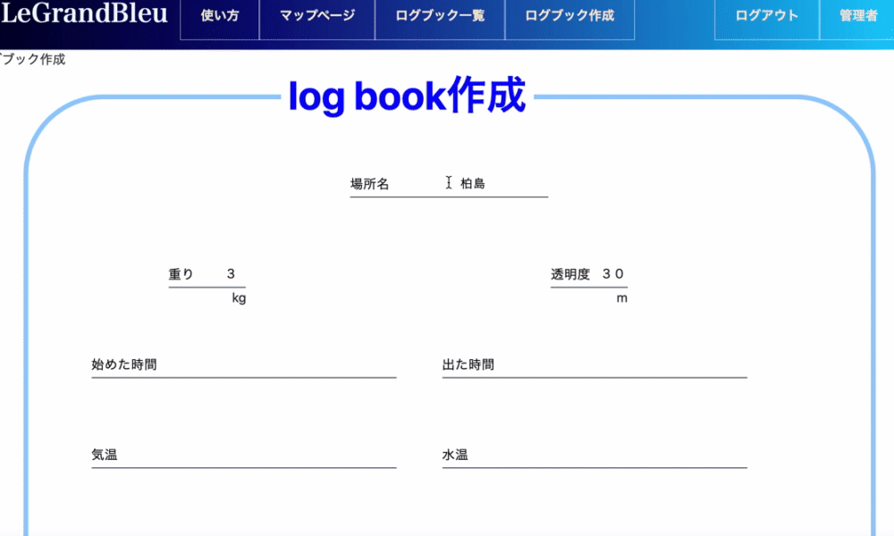

## :tropical_fish: アプリの名前

# le grand bleu

## :art: logo

    

## 🌐 App URL

### **http://3.114.105.194/** 
注・今現在AWSの勉強中で無料枠で利用をしたくインスタンスを停止している場合がございます。それとアプリの改良をしておりますもし上記のURLが使えないときはこちらのURLを確認してください。

https://le-grand-bleu2.herokuapp.com/

テストID：管理者 
email: "admin@example.jp" 
テストPASS：11111111

## 制作背景
 当アプリはダイビングでのログブックの管理および各ダイビングスポットの海の状態や生物を検索しやすくすることを目的に作成しました。 

 今まで私は数々のダイビングスポットで数々の友達ができました。しかし大抵がそのダイビングの時だけの繋がりで終わってしまうことに寂しさを感じていました。そこで出会った人たちといつまでもダイビングを通じて繋がることを目的として当アプリを作りました。
## 使い方
### **http://3.114.105.194/explanation**
上記のURLが見れない場合はこちらをご確認ください。
https://le-grand-bleu2.herokuapp.com/explanation
### テストID：管理者
### テストPASS：11111111
# 掲示板投稿機能の使い方
1.管理者ユーザーでログインする 
  テストID：管理者 
  email: "admin@example.jp" 
  テストPASS：11111111 
2.管理者でログインするとマップページの下に緯度、経度、場所名の入力欄が現れるので記入をして作成ボタンをクリック 

3.マップにピンが刺さりクリックすると掲示板に遷移ができる 

# ログブック投稿機能の使い方
1.ログインをする 

2.ヘッダーのログブック作成ボタンをおす 

3.記入欄を記入してしたの作成ボタンをおす 

 
## これから実装していきたい機能
 
- 任意でみんなのログブックをみれる機能の実装
- メッセージ機能の実装
- フォロー機能の実装
- ダイビングショップと一般ユーザーを分ける
- circleCIでテストコードを自動で走らせる
- reactの導入

## 苦労した点

マップでの掲示板投稿機能を作成するときに当初は住所を入力することで緯度経度へ変換し掲示板を作成する機能を作りました。
完成した時に海に住所はないことに気づき緯度経度を直接入力して掲示板を作成する機能へマイナーチェンジしましたorz

## 使用技術
ruby,javascript,RubyonRails,bootstrap,AWS,capistrano,rspec

# テーブル設計

## users テーブル

| Column             | Type   | Options        |
| ------------------ | ------ | -------------- |
| nickname           | string | null: false    |
| encrypted_password | string | null: false    |
| email              | string | null: false    |
| name               | string | null: false    |
| birth_date         | date   | null: false    |
| admin              | boolean| default: false |
### Association
has_many :log_books
has_many :comments

## log_books テーブル

| Column                    | Type     | Options     |
| ------------------------- | -------  | ----------- |
| place                     | string   | null: false |
| temperature               | string   |             |
| water_temperature         | string   |             |
| transparency              | string   |             |
| en_time                   | string   |             | 
| ex_time                   | string   |             |
| deep_avg                  | string   |             |
| deep_max                  | string   |             |
| date                      | date     |             |
| weight                    | string   |             |
| wear                      | text     |             |
| free_space                | text     |             |
| member                    | text     |             |
| user                      |references| null: false |
### Association

belongs_to :user

## map_place テーブル

|Column	     |Type   |Options          |
| -----------|------ |-----------------|
|place_name  |string |null: false      |
|description |text   |null: false      |
| latitude   |float	 | null: false     |
| longitude	 |float	 | null: false     |

### Association
has_many :comments

## comments テーブル

| Column   | Type       | Options                        |
| -------- | ---------- | ------------------------------ |
| content  | text       |                                |
| user     | references | null: false, foreign_key: true |
| map_place| references | null: false, foreign_key: true |

### Association

- belongs_to :map_place
- belongs_to  :user
